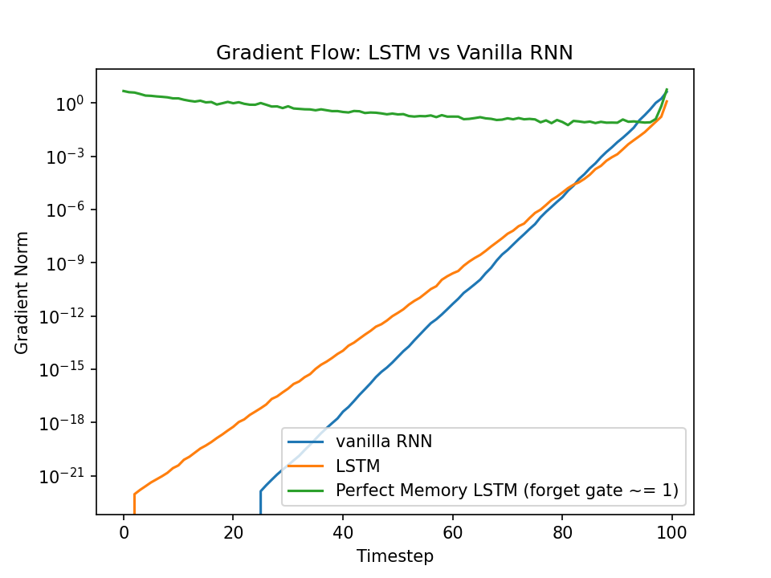

# LSTM Cell — From Scratch

A from-scratch PyTorch implementation of the Long Short-Term Memory cell
(Hochreiter & Schmidhuber, 1997), built as a learning exercise before using
`nn.LSTM` in the implementations of other NNs that follow.

## Paper

- **Title:** Long Short-Term Memory
- **Authors:** Sepp Hochreiter, Jürgen Schmidhuber
- **Year:** 1997 — Neural Computation 9(8): 1735–1780
- **PDF:** https://www.bioinf.jku.at/publications/older/2604.pdf (predates arXiv)

## Why

To understand the gate mechanics, forget, input, output, and the additive
cell-state update that *mitigates* the vanishing-gradient problem, by
implementing them from scratch rather than reaching for `nn.LSTM`.

## How It Works
The cell takes the current input and previous (hidden state, cell state), and
produces updated versions of both through three gates plus a **candidate**:

- **Forget gate:** sigmoid over [h_prev, x] — determines how much of the
  existing cell state to keep
- **Input gate:** sigmoid over [h_prev, x] — what fraction of the candidate to write into the cell state
- **Candidate:** tanh over [h_prev, x] — the potential new long-term memory (content, not a gate). The cell state is updated as `c = forget·c_prev + input·candidate`.
- **Output gate:** sigmoid over [h_prev, x] — determines what part of the
  updated cell state to expose as the new hidden state: `h = output·tanh(c)`.

The cell state itself is updated additively (old * forget + new * input),
which gives gradients a direct path backward through many time steps — so they
decay far more slowly than in a vanilla RNN (mitigated, not eliminated — see
[Results](#results)).

## Implementation notes

- **Hand-written:** the full gate computation and recurrence (`forward`). Only
  `nn.Parameter` and tensor ops are used — no `nn.LSTM`, no `nn.LSTMCell`.
- **Parameter layout:** weights and biases are stacked in the order `[i, f, g, o]`
  to match `torch.nn.LSTMCell`, so the reference test can copy weights across and
  compare exactly.
- **Deliberately omitted:** peephole connections (so the gates read `[h_prev, x]`,
  not the cell state), and any sequence / multi-layer wrapping — this is a single
  *cell* (one timestep); the sequence loop belongs to later implementations.

## Results

**Reference match.** Given identical weights and inputs, the cell matches
`torch.nn.LSTMCell` within `atol=1e-5`, with and without bias.

**Gradient flow.** `gradient_flow.py` unrolls the cell over a 100-step sequence,
computes a loss on the final hidden state, and records the gradient norm at every
timestep — a direct demonstration of *why* the LSTM exists.



*The vanilla RNN's gradient vanishes within ~25 steps; a standard LSTM (random init,
forget gate ≈ 0.5) preserves it far longer; and an LSTM with the forget-gate bias
raised so the gate ≈ 1 keeps the gradient nearly constant across all 100 steps which is
the initial architecture the LSTM was built around in 1997. Having the gate ≈ 1 makes it so that
the cell state is completely maintained. The forget gate was added later by Gers et al. (2000) specifically to let the network learn to erase things it no longer needed
All three share the same weight initialization (`Uniform(±1/√H)`) under a fixed seed; only the
architecture and forget-gate bias differ.*

## Running it

```bash
pytest tests/              # 4 checks: shapes, default zero-state, nn.LSTMCell match (bias on/off)
python gradient_flow.py    # regenerates assets/gradient_flow.png
```

## What's Next

This cell is the primitive used inside the encoder and decoder LSTMs in
[02-seq2seq/](../02-seq2seq/), where two separate LSTM networks are chained
through a shared hidden state to map one variable-length sequence to another.