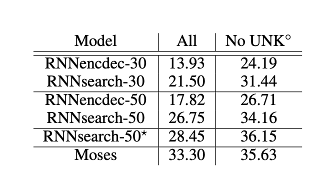

# Attention -  From Scratch

 
## Paper
 
- **Title:** Neural Machine Translation by Jointly Learning to Align and Translate
- **Authors:** Dzmitry Bahdanau, Kyunghyun Cho, Yoshua Bengio
- **Year:** 2015 — ICLR (arXiv 2014)
- **arXiv:** https://arxiv.org/abs/1409.0473

## Notes
### Introduction
- A potential issue with the encoder-decoder approach is that a NN compresses all the information of a source sentence into a fix sized vector. This may make it difficult for the NN to handle long sentences
    - a long sentence gets crammed into the same fixed space as a short one, and information gets lost.
- Introducing the solution:
    1. Instead of squashing the whole source sentence into one fixed-size vector, the encoder keeps a separate hidden state vector for each source word (a sequence of vectors, not just one) 
    2.  The decoder compares its current state to each of the encoder's hidden states and gives each one a relevance score
    3. Apply softmax to turn those scores into probabilities
    4. Blend the source words together using the probabilities to create a "context" vector for that decoding step
    5. Generate the next translated word using the updated hidden state (built from the previous hidden state, previous output word, and context vector)
    
### Learning to align and translate

#### Decoder
- p(yᵢ|y₁,...,yᵢ₋₁,x) = g(yᵢ₋₁, sᵢ, cᵢ)
    - Probability of the current target word given all the previous targets and the whole sentence = g(previous output word, current decoder hidden state and the context vector)
    - g is a NN that turns those three inputs into a probability distribution over the possible next words
- sᵢ = f(sᵢ₋₁, yᵢ₋₁, cᵢ) — the new decoder hidden state is computed from the previous hidden state, previous output word, and the context vector
- The context vector c_i is computed as follows: the weighted sum of the hidden states (annotations) of the encoder
    - c_i = Σ(α_ij * h_j), summed over all source positions j = 1 to T_x
    - α_ij = the weight (probability) for source word j when generating target word i
    - h_j = the encoder's hidden state (annotation) at source position j
- The weight α_ij, for each annotation, h_j is computed by:
    - α_ij = exp(e_ij)/Σ(exp(e_ik)) where e_ij = a(s_{i-1}, h_j)
        - e_ij is the raw score computed by nn a by taking in previous hidden state of the decoder and the hidden state of the encoder for the word being translated. 
        - α_ij is just a softmax that makes the relevance score a probability
- Alignment (the feedforward NN that computes e_ij) is not a latent variable. Its a direct, differentiable computation that is trained
- c_i can be viewed as an expected annotation: implementes attention by indicating to the decoder which parts of the source to focus on.  

#### Encoder
- Uses a BiRNN rather than a regular RNN
    - Runs two seperate RNNs over the sentence. One reas the sentence forward, and the other backward.
    - this way, the combined annotation h_j (concatenated backward and forwards) summarizes everything before and after the word give a richer representation of each word

## Experiment
- Similar to Seq2Seq before it, this paper also evaluates it approach on the task of Eng -> French translation.
- Compares vanilla RNN Encoder-Decoder (fixed context vector) to RNNsearch, which is the proposed approach. As described previously it used bidirectional encoder and at each decoding step a relevance score is computed for each encoded state, producing attention weights to create a context vector, which along with the previous hidden state are used to predict the next word
- SGD with minibatch of 80 sentex and adadelta used to train each model, and beam search to find best translation.
    - extension of SGD that adapts learning rates per parameter eliminating the need to manually tune global learning rate.
- Uses a parallel corpus: paired sentenes in the two languages, with no monolingual corpus
    - Monolingual corpus is text in just the decoded language use to learn "language fluency"

## Results

- RNNsearch outperforms RNNencdec at both training lengths (30 and 50)
- RNNsearch-50* nearly matches Moses on No UNK sentences (36.15 vs 35.63), which is the headline result
- The No UNK column is higher across the board because unknown words are a known failure mode and removing them isolates translation quality itself

